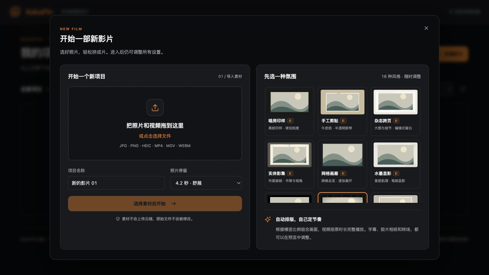

# KakaPin 产品截图

以下均为实际运行界面的截图，不是设计稿。五张编辑与管理截图使用经用户授权的真实照片，仅选择背影和手部细节，避开正脸；新建影片截图使用内置占位插画。

截图在独立演示实例中拍摄，没有改动已有相册。仓库仅收录这些界面截图，不包含原片或演示项目数据；照片本身的权利不因展示而转让，见[素材说明](../THIRD_PARTY_NOTICES.md)。

## 1. 项目库

用封面、名称、素材数量与更新时间辨认项目，搜索后继续编辑，也可以新建影片。

## 2. 编辑工作台

左侧整理素材，中间预览，右侧设置当前画面，下方故事板调整顺序。示例用两张竖图并排，选择拍立得日记模板，不添加画面小字。

## 3. 模板与全片设置

在当前画面上比较模板；右侧切换全片风格、画幅和背景色。示例为手工剪贴模板，背景可用预设、选色器或 HEX 自定义。

## 4. 素材移出与恢复

点击素材下方的「移出影片」，该素材不再参与预览或导出，原文件保留。在「已移出」中点击「重新加入」，会作为独立画面追加到影片末尾；也可以立即撤销移出操作。

## 5. 导出设置

支持常见比例、自定义尺寸与画质选择。示例选中 16:9 横版 4K 和精细画质；界面会明确提醒：目前按 1080p 合成后放大，并非原生 4K 细节。视频保留完整时长，不跟随照片停留秒数。

## 6. 新建影片

导入自己的照片和视频，选择初始风格，再进入编辑工作台。此图中的插画为内置占位内容。

返回[项目首页](../README.md) · 阅读[完整使用指南](user-guide.md)
